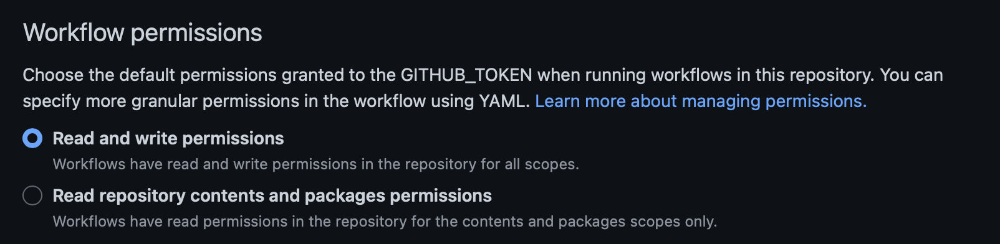

# Overview
The gotchas I found while deploying mkdocs to github pages. 

# Github Action Permissions
Add the necessary Permissions to do write operations in the action: 

This allows you to write back to the current repo you are working in. 

# Configure Github Actions to build your site
I use poetry to manage my dependencies because of that I have to also ensure poetry is installed. The following yaml ensures poetry is installed, install the project dependencies, then deploys the github pages site. 

```yaml
name: Deploy Mkdocs Site

on:
  push:
    branches:
      - main
concurrency:
  group: deployment

jobs:
  Run-Code-Validation:
    runs-on: ubuntu-latest
    steps:
      - uses: actions/checkout@v3
      - name: Install Poetry
        uses: snok/install-poetry@v1
      - name: Set up Python 3.11
        uses: actions/setup-python@v4
        with:
          python-version: 3.11
          cache: 'poetry'
      - name: Install dependencies
        run: poetry install
      - name: Deploy Site
        run: poetry run mkdocs gh-deploy --force --clean
```